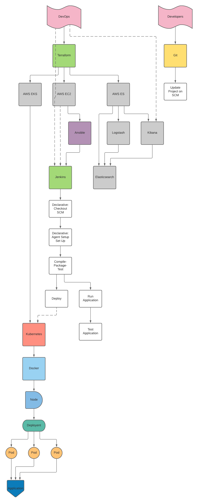
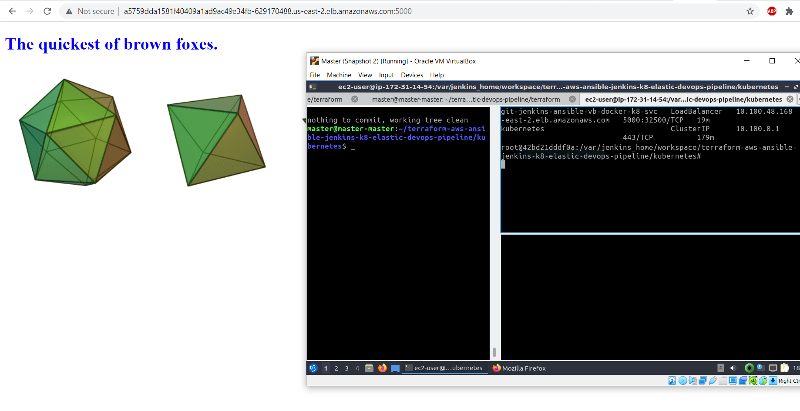
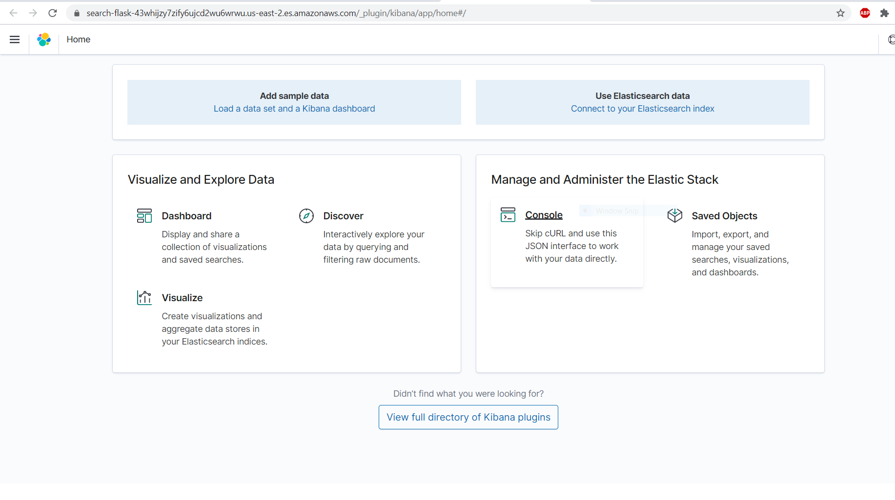

# Terraform AWS Ansible Jenkins K8 Elastic Devops Pipeline
## Prerequisites

1. VM with Terraform and AWS CLI Installed.

## Required by time of the end of this documentation

1. One VM instance
1. Git
1. SCM (such as GitHub)
1. Terraform
1. AWS CLI
1. Ansible
1. Jenkins (specifically Jenkins Configuration as Code)
1. Docker
1. Kubernetes
1. Flask Application
1. AWS Elasticsearch Domain (Logstash, Elasticsearch, Kibana)

**Many of the above requirements are installed automatically and automated.**
## CI/CD with AWS

## Jenkins Configuration as Code (JCASC) on AWS EC2 Instance
### Create a key pair:
1. Sign in to the Open the [Amazon EC2 console](https://console.aws.amazon.com/ec2/ "Amazon EC2 console").
2. In the navigation pane, under NETWORK & SECURITY, choose Key Pairs.
3. Select Create key pair.
4. Use the following command to set the permissions of your private key file so that only you can read it.
```chmod 400 <key_pair_name>.pem```
NOTE: Use `scp` to copy it to your VM if you downloaded the .pem file from another machine:
```scp "<path_to_key>/Jenkins.pem" <user>@<host>:<path_to_key>/<key_pair_name>.pem```

### Create a security group:
1. Sign in to the [AWS Management Console](https://console.aws.amazon.com/ec2/ "AWS Management Console").
2. Open the Amazon EC2 console by choosing EC2 under Compute.
3. Choose your VPC from the list, you can use the default VPC.
4. Find your IP address and . You may use the [checkip service](http://checkip.amazonaws.com/ "checkip service") from AWS3. Run this from your VM that has access to the `<key_pair_name>.pem` file.
5. On the Inbound tab, add the rules as follows:
	1. Click Add Rule, and then choose SSH from the Type list. Under Source, select Custom and in the text box enter <public IP address range that you decided on in step 1>/32 i.e 172.23.23.165/32.
	2. Click Add Rule, and then choose HTTP from the Type list. Enter 0.0.0.0/0
	3. Click Add Rule, and then choose Custom TCP Rule from the Type list. Under Port Range enter 8080. Enter 0.0.0.0/0
	4. Click Create.

### Launch an Amazon EC2 instance Installed with Jenkins Configuration as Code pre-loaded with a Jenkins Job:
#### Connect to your Linux instance:
1. Clone the project on your VM.
3. Create variables.tfvars
4. Run the command: ```aws configure```. This will create a `credentials` file, known as AWS Credentials, for you in `~/.aws` as well as a `config` file.
2. Run the command: ```terraform apply -auto-approve --var-file variables.tfvars```
3. Before you connect to your instance, get the public DNS name of the instance using the Amazon EC2 console. Select the instance and locate Public DNS.
2. Use the ssh command to connect to the instance. You will specify the private key (.pem) file and ec2-user@public_dns_name:
	3. ```ssh -i <path_to_key>/<key_pair_name>.pem ec2_user@<ec2_public_dns>``` NOTE: `ec2_user` is the default ec2 instance user. Replace it if you have setup another user.
3. Copy the Key and AWS Credentials files on your VM to the EC2 Instance.
3. SSH into your EC2 Jenkins Container: ```ssh -i <path_to_key>/<key_name>.pem ec2-user@<ec2_public_ip>``` then run the following commands:
	1. ```aws configure``` and input `AWS Access Key ID`, `AWS Secret Access Key`, `Default Region Name` and `Default Output Format`.
	2. ```aws eks --region $(terraform output -raw aws_region) update-kubeconfig --name $(terraform output -raw cluster_name)```
4. In Jenkins (access the dashboard from a URL), re-build the Jenkins job. Make sure the kube config file copied correctly if not then re-run terraform apply command then re-build the Jenkins job.
5. In EC2 Jenkins Container, run the command: ```kubectl port-forward <pod_name_example_wfjdz> 5000:5000```
6. Go to your EKS Cluster's `API server endpoint` appended with port 5000 in a browser.




## AWS Elasticsearch Service (ES) Monitoring with Metricbeat and Filebeat
### Description:
The Elastic Stack makes use of a DaemonSet to ensure all, or some, nodes run a copy of beat inside a pod. Metricbeat and filebeat send data to Logstash to get stored in the Elasticsearch database. Kibana is used as a visual dashboard to analyze the data.

### Create an AWS Elasticsearch Domain with Logstash, Elasticsearch and Kibana:
1. Sign In to the Console.
1. Under Analytics, choose Elasticsearch Service.
1. Choose Create a new domain.
1. On the Create Elasticsearch domain page, choose Development and testing.
1. For Elasticsearch version, choose the latest version and Next.
1. Enter a name for the domain. In this tutorial, we use the domain name movies for the examples that we provide later in the tutorial.
1. For Data nodes, choose the c5.large.elasticsearch instance type. Use the default value of 1 instance. Amazon ES now offers t2.micro.elasticsearch and t2.small.elasticsearch instances which are allowed in the AWS Free Tier. t2.small.elasticsearch instances will not allow fine-grained access control.
1. For Data nodes storage, use the default values.
1. Choose Next.
1. For simplicity in this tutorial, we recommend a public access domain. For Network configuration, choose Public access.
1. For Fine-grained access control, choose Create master user. Specify a username and password.
1. For Access policy, choose Allow open access to the domain. In this tutorial, fine-grained access control handles authentication, not the domain access policy.
1. Choose Next.
1. On the Review page, double-check your configuration and choose Confirm. New domains typically take 15-30 minutes to initialize, but can take longer depending on the configuration. After your domain initializes, make note of its endpoint.
2. Go to your Kibana Endpoint to view your Dashboard:



### Create Kubernetes Resources:
1. Clone the kube-state-metrics repository from [https://github.com/kubernetes/kube-state-metrics](https://github.com/kubernetes/kube-state-metrics) This is needed for beat to fully function.
2. Deploy kube-state-metrics with the following command:
	1. `kubectl apply -f kube-state-metrics/examples/standard`
2. Deploy your secrets with the following command:
	1. `kubectl apply -f secrets/secrets.yaml`
2. Deploy metricbeat for kubernetes 
	3. `kubectl apply -f beats/metricbeat-kubernetes.yaml`
4. Deploy filebeat for kubernetes 
	5. `kubectl apply -f beats/filebeat-kubernetes.yaml`

### Stress the System:
1. Install the `stress` command:
	1. `sudo apt install stress`
1. Run the command to stress the system for 25 seconds, with more detailed output (`-v` flag):
	1. ```stress -v --cpu 4 --timeout 25```
2. Observe the results in Kibana.

## Thoughts
1. JCASC Environment Variables poses a security risk
2. Mounting Docker .sock poses a security risk
3. Ended up installing Docker on jcasc container because trying to mount /usr/bin/docker causes docker container to exit container after 1 second
4. Automate AWS Key and Security Group
5. Automate AWS Elasticsearch Domain
5. How to wait for EKS before EC2 runs the `ansible-playbook` command
5. How to configure JCASC container with AWS Credentials

### Help - Manually Destroying an AWS Cluster:
1. Some resources do not get destroyed, possibly due to Security Groups or if different IAM Users are trying to access resources. If tearing down the cluster manually, then you might consider use of this command after a failure: ```terraform state rm module.eks.kubernetes_config_map.aws_auth```
